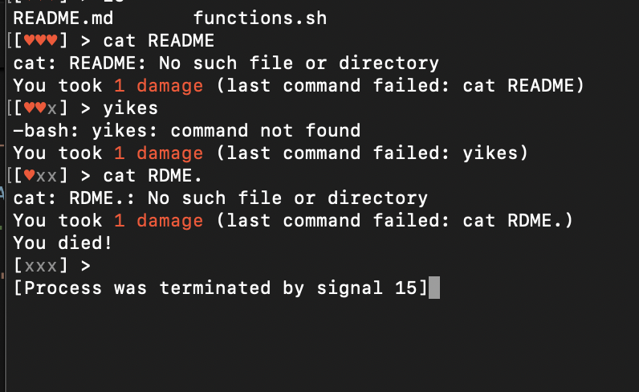

# Shell Hitpoints

This script gives your shell hitpoints. You start with 3 hp. Every time you run
a command that fails, you take damage. If you run out of hp, the shell exits.



## How?

```sh
# This replaces your PS1 with a command that counts hitpoints.
. functions.sh
```

The hitpoints are stored in a tmp file that gets cleaned up on exit. Bash
trickery even ensures you don't take damage repeatedly from the same error.

## API

Of course this system comes with an API, in case you're the kind of person who
wants to extend this:

```sh
# Deals damage
shhp_damage [AMOUNT]

# Heals by the specified amount
shhp_heal [AMOUNT]

# Overheals (Zelda BOTW rules) by the specified amount, giving you extra hearts.
shhp_overheal [AMOUNT]
```

## But why?

I don't understand the question.
